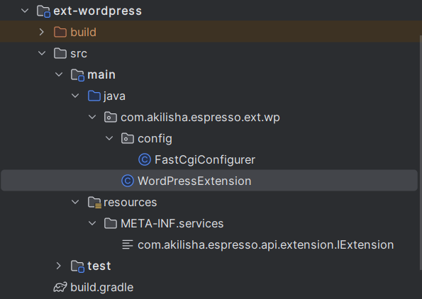

## Extension

An _Extension_, in the context of the _jipress framework_, is an abstraction that can best be understood by examining
its core characteristics:

1. create an entire servlet-based application that will be added to an instance of ```ServletContextHandler```
2. extends the _IExtension_ interface to gain access to the _<T> void extendWith(T extensionPoint)_ function. This is
   the point where this new functionality will be attached to the _jipress_ framework
3. package the well-tested, implementation classes as a library module in a pre-defined manner.
4. make the packaged jars available in either the class-path (traditional way, but still vastly used) or in the
   module-path (more modern way, but not vastly used).

In doing this, the target classes in the loaded jars will be picked up by the framework's _ServiceLoader_ and get
integrated with the rest of the framework as it loads up.

The _IExtension_ interface is meant to meet the specific needs of individual developers and not those of the
framework, and hence the only available implementation is a demonstration module, and developers are expected to provide
their own implementations.

_ext-wordpress_: provides a demo implementation for _IExtension_



#### WordPressExtension

This class implements the IExtension interface.

```java
public interface IExtension {

    String contextPath();

    String resourceRoot();

    void resourceRoot(String resourceRoot);

    <T> void extendWith(T extensionPoint);
}
```

The _String contextPath()_ method should return a unique identifier which will be used in the request URL as the base
_context path_.

The _String resourceRoot()_ method should return the path to the folder which will serve static content.

The _void resourceRoot(String resourceRoot)_ will set the path to the folder which will serve static content.

The _<T> void extendWith(T extensionPoint)_ method present an _extensionPoint_ where the servlet context will be added.
In practise, this extension point will always be the 'ContextCollectionHandler' object that is native to _Jetty_.

```java
public class WordPressExtension implements IExtension {

    String contextPath = "/";
    String resourceRoot = System.getProperty("WORDPRESS_HOME");

    @Override
    public String contextPath() {
        return this.contextPath;
    }

    @Override
    public String resourceRoot() {
        return this.resourceRoot;
    }

    @Override
    public void resourceRoot(String resourceRoot) {
        this.resourceRoot = resourceRoot;
    }

    @Override
    public <T> void extendWith(T extensionPoint) {
        try {
            ServletContextHandler context = createServletContext(this.contextPath(), this.resourceRoot());
            configureTryFilesFilter(context);
            configureDefaultServletHandler(context);
            configureFastCgiHandler(context, this.resourceRoot());
            ((ContextHandlerCollection) extensionPoint).addHandler(context);
        } catch (IOException e) {
            throw new RuntimeException(e);
        }
    }
}
```

#### ServiceLoader

```bash
ext-wordpress/src/main/resources/
`-- META-INF
    `-- services
        `-- com.akilisha.espresso.api.extension.IExtension

```

#### Service Implementations

Inside the ServiceLoader resource file, there is just one entry, since this module has only one implementation of
_IRouterHandle_ ```com.akilisha.espresso.ext.fcgi.FastCgiExtension```

This method of specifying the Service class is using the class-path loading mechanism. If module-path was in play
instead, this last step would not have been necessary. Simply adding a ```module-info.java``` file into the source
folder would be sufficient to make the module discoverable by Java's ServiceLoading mechanism automatically.

#### Loading plugin options

There are four important ```cli options``` to remember when loading plugins. Plugins and extensions are organized under
a single root folder, reference by the ```pluginsHome``` variable. Beneath the root folder, other folders may exist
and specify where certain jars are located. The extensions folder is referenced through the ```ctxExtensions```
variable name.

| variable name | description                             |
|---------------|-----------------------------------------| 
| pluginsHome   | plugins home directory                  |
| ctxExtensions | context extension plugins sub-directory |

When starting up the application, specify the appropriate cli options:

```java -jar <executable jar> -pluginsHome <plugins dir> -ctxExtensions <extensions dir>```

And that should do it for extensions.
