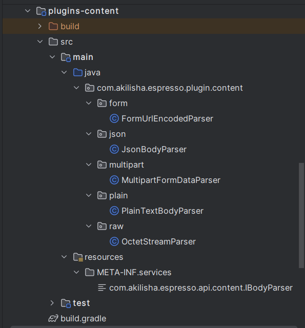
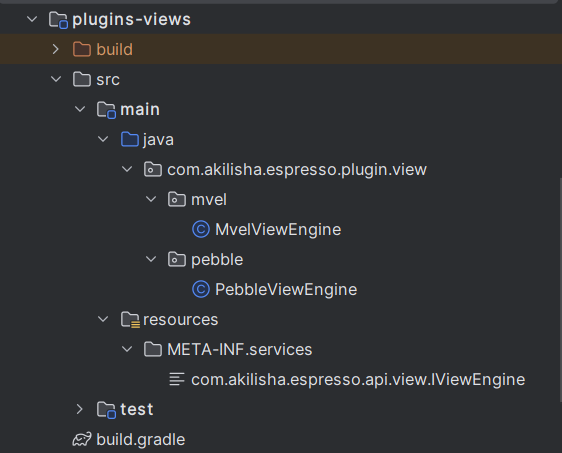
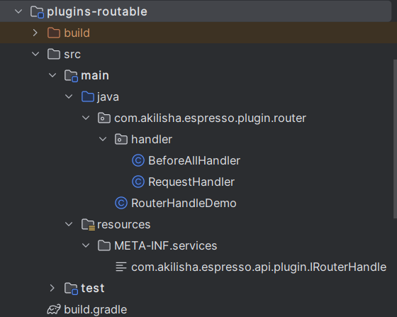

## Plugin

A _Plugin_, in the context of the _jipress framework_, is an abstraction that can best be understood by examining its
core characteristics:

1. attach new behavior or replace existing behavior in the _jipress_ framework through implementing certain designated
   interfaces.
2. package the well-tested, implementation classes as a library module in a pre-defined manner.
3. make the packaged jars available in either the class-path (traditional way, but still vastly used) or in the
   module-path (more modern way, but not vastly used).

In doing this, the target classes in the loaded jars will be picked up by the framework's _ServiceLoader_ and get
integrated with the rest of the framework as it loads up.

The interfaces that are currently loadable as plugin extensions are:

1. _IBodyParser_
2. _IViewEngine_
3. _IRouterHandle_

For the first two interfaces, the default implementations are already provided through the following modules:

1. _plugins-content_: provides implementations for _IBodyParser_



2. _plugins-views_: provides implementations for _IViewEngine_



The third interface, however, is meant to meet the specific needs of individual developers and not those of the
framework, and hence the only available implementation is a demonstration module, and developers are expected to provide
their own implementations.

3. _plugins-routable_: provides a demo implementation for _IRouterHandle_



#### RouterHandleDemo

This class implements the IRouterHandle interface.

```java
public interface IRouterHandle {

    String contextPath();

    void init(IRouter app);
}
```

The _String contextPath()_ method should return a unique identifier which will be used in the request URL as the base
_context path_.

The _void init(IRouter app)_ method will get an opportunity to load _IMiddleware_ handlers to the _IRouter_ app, before
it is loaded and integrated into the framework during start-up.

```java
public class RouterHandleDemo implements IRouterHandle {

    String contextPath = "/demos";

    @Override
    public String contextPath() {
        return this.contextPath;
    }

    public void init(IRouter app) {

        app.all("/es", new BeforeAllHandler());

        // curl http://localhost:3000/en
        app.method("get", "/en", new RequestHandler("GET Hello World!"));

        // curl -X POST http://localhost:3000/en
        app.method("post", "/en", new RequestHandler("POST Hello World!"));

        // curl -X PUT http://localhost:3000/en
        app.method("put", "/en", new RequestHandler("PUT Hello World!"));

        // curl -X DELETE http://localhost:3000/en
        app.method("delete", "/en", new RequestHandler("DEL Hello World!"));

        // curl http://localhost:3000/es
        app.get("/es", new RequestHandler("GET Hola Mundo!"));

        //  curl -X POST http://localhost:3000/es
        app.post("/es", new RequestHandler("POST Hola Mundo!"));

        // curl -X PUT http://localhost:3000/es
        app.put("/es", new RequestHandler("PUT Hola Mundo!"));

        // curl -X DELETE http://localhost:3000/en
        app.delete("/es", new RequestHandler("DEL Hola Mundo!"));

        // curl http://localhost:3000/es/10/10/2023
        app.get("/es/:day/:month/:year", (req, res, next) -> {
            String msg = String.format("%s/%s/%s", req.param("day"), req.param("month"), req.param("year"));
            res.send(msg);
        });
    }
}
```

#### BeforeAllHandler

```java
public class BeforeAllHandler implements IMiddleware {
    @Override
    public void handle(IRequest req, IResponse res, INext next) {
        res.send("ALL Holla Mundo!");
    }
}
```

#### RequestHandler

```java

@RequiredArgsConstructor
public class RequestHandler implements IMiddleware {

    final String message;

    @Override
    public void handle(IRequest req, IResponse res, INext next) {
        res.send(this.message);
    }
}
```

#### ServiceLoader

```bash
plugins-routable/src/main/resources/
`-- META-INF
    `-- services
        `-- com.akilisha.espresso.api.plugin.IRouterHandle
        
```

#### Service Implementations

Inside the ServiceLoader resource file, there is just one entry, since this module has only one implementation of
_IRouterHandle_ ```com.akilisha.espresso.plugin.router.RouterHandleDemo```

This method of specifying the Service class is using the class-path loading mechanism. If module-path was in play
instead, this last step would not have been necessary. Simply adding a ```module-info.java``` file into the source
folder would be sufficient to make the module discoverable by Java's ServiceLoading mechanism automatically.

#### Loading plugin options

There are four important ```cli options``` to remember when loading plugins. Plugins and extensions are organized under
a single root folder, reference by the ```pluginsHome``` variable. Beneath the root folder, other folders may exist
and specify where certain jars are located. There are referenced through the ```viewEngines```, ```bodyParsers``` and
```routerHandles``` variable names.

| variable name | description                         |
|---------------|-------------------------------------| 
| pluginsHome   | plugins home directory              |
| viewEngines   | view engine plugins sub-directory   |
| bodyParsers   | body parser plugins sub-directory   |
| routerHandles | router handle plugins sub-directory |

When starting up the application, specify the appropriate cli options:

```java -jar <executable jar> -pluginsHome <plugins dir> -routerHandles <routers dir>```

And that should do it for plugins.
